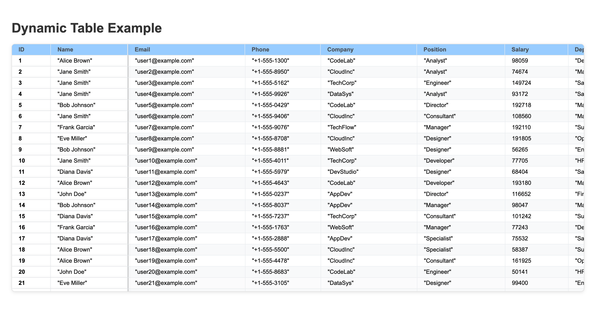

# NgxSimpleDatatable

A lightweight, high-performance Angular data table component with features like virtual scrolling, column freezing, and customizable templates.



## Features

- 📊 Virtual scrolling for smooth performance with large datasets
- ❄️ Freeze columns (left/right) for better data comparison
- 🔍 Sortable columns with custom sort functions
- 🎨 Customizable templates for headers and cells
- 📏 Resizable columns
- 🎨 Theming support with CSS custom properties
- ♿ Built with accessibility in mind

## Installation

```bash
npm install ngx-simple-datatable --save
```

## Basic Usage

1. Import the module in your `app.module.ts`:

```typescript
import { NgxSimpleDatatableModule } from "ngx-simple-datatable";

@NgModule({
  imports: [
    // ... other imports
    NgxSimpleDatatableModule,
  ],
})
export class AppModule {}
```

2. Use the component in your template:

```html
<ngx-simple-datatable
  [columns]="columns"
  [data]="data"
  [rowHeight]="40"
  [headerHeight]="50"
>
</ngx-simple-datatable>
```

3. Define your columns and data in your component:

```typescript
import { Component } from "@angular/core";
import { ColumnConfig } from "ngx-simple-datatable";

interface UserData {
  id: number;
  name: string;
  email: string;
  status: string;
}

@Component({
  selector: "app-root",
  templateUrl: "./app.component.html",
  styleUrls: ["./app.component.css"],
})
export class AppComponent {
  columns: ColumnConfig[] = [
    { field: "id", header: "ID", width: "80px", freeze: "left" },
    { field: "name", header: "Name", width: "200px", sortable: true },
    { field: "email", header: "Email", width: "250px" },
    { field: "status", header: "Status", width: "120px" },
  ];

  data: UserData[] = [
    { id: 1, name: "John Doe", email: "john@example.com", status: "Active" },
    {
      id: 2,
      name: "Jane Smith",
      email: "jane@example.com",
      status: "Inactive",
    },
    // ... more data
  ];
}
```

## Advanced Features

### Column Freezing

Freeze columns to the left or right for better data comparison:

```typescript
columns: ColumnConfig[] = [
  { field: 'id', header: 'ID', width: '80px', freeze: 'left' },
  { field: 'name', header: 'Name', width: '200px' },
  { field: 'email', header: 'Email', width: '250px' },
  { field: 'actions', header: 'Actions', width: '150px', freeze: 'right' }
];
```

### Custom Cell Templates

Use Angular templates to customize cell content:

```html
<ngx-simple-datatable [columns]="columns" [data]="data">
  <ng-template #cellTemplate let-row="row" let-column="column">
    <ng-container [ngSwitch]="column.field">
      <ng-container *ngSwitchCase="'status'">
        <span
          [ngClass]="{
          'status-active': row[column.field] === 'Active',
          'status-inactive': row[column.field] !== 'Active'
        }"
        >
          {{ row[column.field] }}
        </span>
      </ng-container>
      <ng-container *ngSwitchDefault> {{ row[column.field] }} </ng-container>
    </ng-container>
  </ng-template>
</ngx-simple-datatable>
```

### Custom Header Templates

Customize header appearance and behavior:

```html
<ngx-simple-datatable [columns]="columns" [data]="data">
  <ng-template #headerTemplate let-column="column">
    <div class="custom-header">
      <i class="fas fa-info-circle" [title]="column.header"></i>
      <span>{{ column.header }}</span>
      <i class="fas fa-sort" *ngIf="column.sortable"></i>
    </div>
  </ng-template>
</ngx-simple-datatable>
```

### Theming

Customize the table appearance using CSS custom properties:

```css
/* styles.css */
:root {
  --ngx-simple-dt-bg: #efefef;
  --ngx-simple-dt-border: 1px solid #e0e0e0;
  --ngx-simple-dt-border-radius: 8px;
  --ngx-simple-dt-box-shadow: 0 2px 8px rgba(0, 0, 0, 0.1);
  --ngx-simple-dt-transition: all 0.2s ease-in-out;

  --ngx-simple-dt-header-bg: #98ccff;
  --ngx-simple-dt-header-hover-bg: #e9ecef;
  --ngx-simple-dt-header-border: 1px solid #e0e0e0;
  --ngx-simple-dt-header-text: #495057;
  --ngx-simple-dt-header-height: 48px;
  --ngx-simple-dt-header-font-weight: 600;
  --ngx-simple-dt-header-padding: 0 16px;

  --ngx-simple-dt-cell-padding: 0 16px;
  --ngx-simple-dt-cell-border: 1px solid #e9ecef;
  --ngx-simple-dt-cell-hover-bg: #f1f3f5;
  --ngx-simple-dt-cell-active-bg: #e9ecef;
  --ngx-simple-dt-cell-font-size: 0.875rem;
  --ngx-simple-dt-cell-line-height: 1.5;

  --ngx-simple-dt-row-height: 48px;
  --ngx-simple-dt-row-hover-bg: #f8f9fa;
  --ngx-simple-dt-row-stripe-bg: #f8f9fa;
  --ngx-simple-dt-row-active-bg: #e9ecef;
  --ngx-simple-dt-cell-padding: 0 16px;
  --ngx-simple-dt-cell-border: 1px solid #e9ecef;
  --ngx-simple-dt-cell-font-size: 0.875rem;
  --ngx-simple-dt-cell-line-height: 1.5;

  --ngx-simple-dt-row-bg: #ffffff;
  --ngx-simple-dt-row-hover-bg: #f8f9fa;
  --ngx-simple-dt-row-stripe-bg: #f8f9fa;
  --ngx-simple-dt-row-active-bg: #e9ecef;
  --ngx-simple-dt-row-border: 1px solid #e9ecef;
}
```

## API Reference

### Inputs

| Input            | Type             | Description                                                    |
| ---------------- | ---------------- | -------------------------------------------------------------- |
| `[columns]`      | `ColumnConfig[]` | Array of column configurations                                 |
| `[data]`         | `any[]`          | Array of data to display                                       |
| `[rowHeight]`    | `number`         | Height of each row in pixels                                   |
| `[headerHeight]` | `number`         | Height of the header row in pixels                             |
| `[bufferSize]`   | `number`         | Number of rows to render outside viewport for smooth scrolling |

### Column Configuration

| Property   | Type                         | Description                      |
| ---------- | ---------------------------- | -------------------------------- | ---------------------- |
| `field`    | `string`                     | Property name in the data object |
| `header`   | `string`                     | Column header text               |
| `width`    | `string                      | number`                          | Column width (px or %) |
| `freeze`   | `'left'                      | 'right'`                         | Freeze column position |
| `sortable` | `boolean`                    | Whether the column is sortable   |
| `sortFn`   | `(a: any, b: any) => number` | Custom sort function             |

## Styling

You can customize the table appearance by overriding the following CSS custom properties:

```css
.dynamic-table-container {
  --ngx-simple-dt-bg: #ffffff;
  --ngx-simple-dt-border: 1px solid #e0e0e0;
  --ngx-simple-dt-border-radius: 8px;
  --ngx-simple-dt-box-shadow: 0 2px 8px rgba(0, 0, 0, 0.1);
  --ngx-simple-dt-transition: all 0.2s ease-in-out;
}

.table-header {
  --ngx-simple-dt-header-bg: #f8f9fa;
  --ngx-simple-dt-header-hover-bg: #e9ecef;
  --ngx-simple-dt-header-border: 1px solid #e0e0e0;
  --ngx-simple-dt-header-text: #495057;
  --ngx-simple-dt-header-height: 48px;
  --ngx-simple-dt-header-font-weight: 600;
  --ngx-simple-dt-header-padding: 0 16px;
}
```

## Development

Run `ng build ngx-simple-datatable` to build the library. The build artifacts will be stored in the `dist/` directory.

## Publishing

After building your library with `ng build ngx-simple-datatable`, go to the dist folder `cd dist/ngx-simple-datatable` and run `npm publish`.

After building your library with `ng build ngx-simple-datatable`, go to the dist folder `cd dist/ngx-simple-datatable` and run `npm publish`.

## Running unit tests

Run `ng test ngx-simple-datatable` to execute the unit tests via [Karma](https://karma-runner.github.io).

## Further help

To get more help on the Angular CLI use `ng help` or go check out the [Angular CLI Overview and Command Reference](https://angular.io/cli) page.
